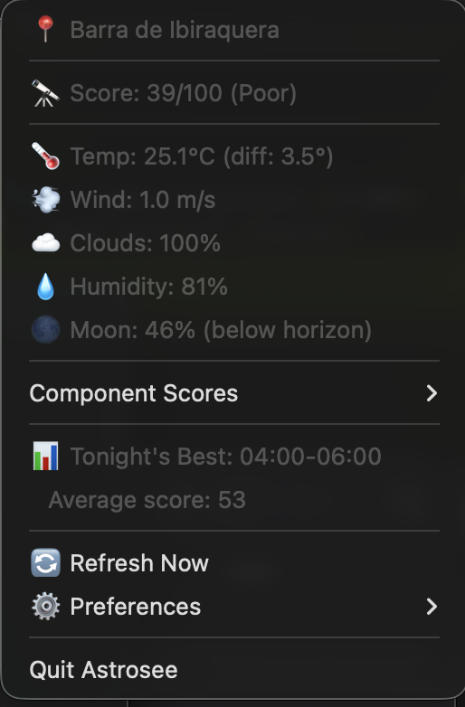

# Astrosee

**Astronomical Seeing Prediction CLI for macOS**

Know when to set up your telescope. Astrosee predicts observation quality based on atmospheric conditions, calculating a "seeing score" that tells you if tonight is worth dragging out your gear.

```
╔══════════════════════════════════════════════════════════════╗
║           ASTRONOMICAL SEEING FORECAST                       ║
║           Criciuma, SC (29.18°S, 49.64°W)                   ║
║           2026-01-10 22:30 BRT                              ║
╚══════════════════════════════════════════════════════════════╝

┏━━━━━━━━━━━━━━━━━━━━┳━━━━━━━━┳━━━━━━━━━━━━━━━━━━━━━━━━━━━━┓
┃ Overall Score      ┃   78   ┃  ████████░░  VERY GOOD     ┃
┗━━━━━━━━━━━━━━━━━━━━┻━━━━━━━━┻━━━━━━━━━━━━━━━━━━━━━━━━━━━━┛
```

## Features

- **Real-time Seeing Score** (0-100) based on multiple atmospheric factors
- **macOS Menu Bar Widget** - Quick access to conditions without terminal
- **7-Day Forecast** with daily summaries and trend charts
- **Target Tracking** - Get conditions for specific objects (Jupiter, M31, etc.)
- **Best Window Finder** - Automatically find optimal observation times
- **Timelapse Planner** - Find optimal multi-hour imaging windows with altitude tracking
- **Session Logger** - Track observations with ratings, notes, and equipment
- **Equipment Advisor** - Get activity and equipment recommendations based on conditions
- **Live Watch Mode** - Continuous monitoring with auto-refresh
- **Location Comparison** - Compare conditions across multiple sites
- **Smart Alerts** - Get notified when conditions are perfect
- **200+ Built-in Objects** - Messier catalog, NGC favorites, all planets
- **Works Offline** - Intelligent caching for uninterrupted use
- **Beautiful Terminal UI** - Rich colors, tables, and optional graphs

## Installation

### Requirements

- macOS (tested on macOS 13+)
- Python 3.11 or higher
- Internet connection (for weather data)

### Install via pip

```bash
# Clone the repository
git clone https://github.com/marcosgabbardo/astrosee.git
cd astrosee

# Install in development mode
pip install -e .

# Or install directly
pip install .
```

### Verify Installation

```bash
astrosee --version
# astrosee, version 0.1.0

astrosee --help
```

## Quick Start

### 1. Configure Your Location

```bash
# Set your observing location
astrosee config set --lat -29.18 --lon -49.64 --name "Home Observatory"

# Verify it was saved
astrosee config list
```

### 2. Check Current Conditions

```bash
astrosee now
```

### 3. Plan Your Session

```bash
# 7-day forecast
astrosee forecast

# Find the best observation window in the next 48 hours
astrosee best-window --hours 48

# Check conditions for a specific target
astrosee target Jupiter
astrosee target M42
astrosee target "Andromeda Galaxy"
```

## Commands Reference

### `astrosee config`

Manage locations and settings.

```bash
# Add a new location
astrosee config set --lat -29.18 --lon -49.64 --name "Criciuma"

# Add a dark sky site
astrosee config set --lat -28.05 --lon -49.59 --name "Urubici" --elevation 1800

# List all locations
astrosee config list

# Set default location
astrosee config default "Urubici"

# Remove a location
astrosee config remove "Old Site"

# Show full configuration
astrosee config show
```

### `astrosee now`

Display current seeing conditions.

```bash
# Current conditions at default location
astrosee now

# For a specific location
astrosee now --location "Dark Site"

# With a target object
astrosee now --target Jupiter
astrosee now -t M31 -l "Mountain Observatory"
```

**Example output:**

```
╭──────────────────────────────────────────────────────────────────────────────╮
│ ASTRONOMICAL SEEING FORECAST                                                 │
│ Barra de Ibiraquera (28.16°S, 48.66°W)                                       │
│ 2026-01-11 00:19                                                             │
╰──────────────────────────────────────────────────────────────────────────────╯
╭─────────────────────────────── Overall Score ────────────────────────────────╮
│ 38  ███░░░░░░░  POOR                                                         │
╰──────────────────────────────────────────────────────────────────────────────╯
            Conditions Breakdown
 ├─ Temperature Stability  61  ██████░░░░
 ├─ Wind Conditions        39  ███░░░░░░░
 ├─ Humidity               48  ████░░░░░░
 ├─ Cloud Cover            21  ██░░░░░░░░
 ├─ Jet Stream             95  █████████░

           Atmospheric Details
 ├─ Temp differential:  4.1°C (unstable)
 ├─ Wind shear:         2.0 m/s (low)
 ├─ Surface wind:       4.7 km/h NNW
 ├─ Cloud cover:        91%
 ├─ Humidity:           78%
 ├─ Pressure:           1009 hPa
 └─ Jet stream:         25 m/s (calm)

Moon: 🌓 First Quarter (47% illuminated) (below horizon)

╭─────────────────────────────── Recommendation ───────────────────────────────╮
│ Poor conditions. Only bright objects recommended.                            │
│                                                                              │
│   Planets: Fair                                                              │
│   Moon: Good                                                                 │
│   Deep Sky: Fair                                                             │
│   Imaging: Not recommended                                                   │
╰──────────────────────────────────────────────────────────────────────────────╯
```

### `astrosee forecast`

Show multi-day seeing forecast.

```bash
# Default 7-day forecast
astrosee forecast

# Custom duration
astrosee forecast --hours 72

# Hourly detail instead of daily summary
astrosee forecast --hourly

# Without the trend chart
astrosee forecast --no-chart
```

**Example output:**

```
Score Trend
100 ┤
    ┤
    ┤
    ┤
    ┤
    ┤      ▄                                       ▂▂
 50 ┤ ▂▆▄ ▆█                                       ██▆
    ┤▂███ ██            ▂▆ █               ▄       ███
    ┤████ ██           ███ █     ▂▆▂     ▆██     ▂▄███
    ┤████ ██   █▂  ▂   ███▂█  ▄ ▆███    ▂███    ▄█████      ███
    ┤████ ██ █▂██  █   █████  ██████   ▆████    ██████      ███
  0 ┤████▄██▄████▄▂█▆▄▄█████▄▆██████▄▆▄█████▆▆▆▆██████▆▄▄▄▄▄███▄▆
    └────────────────────────────────────────────────────────────
     00:00                      12:00                       23:00

                  7-Day Forecast
┏━━━━━━━━━━┳━━━━━━━┳━━━━━━━━━━━━━━━━━━━━━━━━━━━━━┓
┃ Date     ┃ Score ┃ Summary                     ┃
┡━━━━━━━━━━╇━━━━━━━╇━━━━━━━━━━━━━━━━━━━━━━━━━━━━━┩
│ Sun 11th │    41 │ Good. variable clouds. calm │
│ Tue 13th │    33 │ Good. variable clouds. calm │
│ Fri 16th │    31 │ Good. partly cloudy. calm   │
│ Thu 15th │    28 │ Good. variable clouds. calm │
│ Wed 14th │    24 │ Good. variable clouds. calm │
│ Mon 12th │    23 │ Good. variable clouds. calm │
│ Sat 17th │     4 │ Good. variable clouds. calm │
└──────────┴───────┴─────────────────────────────┘

⭐ Best night: Sun 11th (score: 41)
```

### `astrosee target`

Get conditions for a specific celestial object.

```bash
# Planet
astrosee target Jupiter
astrosee target Saturn

# Deep-sky object
astrosee target M42
astrosee target "Orion Nebula"
astrosee target NGC7000

# Bright stars
astrosee target Sirius
astrosee target Betelgeuse

# With visibility forecast
astrosee target M31 --hours 24
```

**Example output:**

```
Target: Jupiter (Jupiter)
Gas giant with bands

Current Status:
  Altitude: 23.6°
  Azimuth: 45.5°
  Airmass: 2.49 (Poor)
  Magnitude: -2.9

Seeing Score for Jupiter: 29/100 (Poor)

             Target: Jupiter
┏━━━━━━━┳━━━━━┳━━━━━━━━━┳━━━━━━━┳━━━━━━━┓
┃ Time  ┃ Alt ┃ Airmass ┃ Score ┃ Night ┃
┡━━━━━━━╇━━━━━╇━━━━━━━━━╇━━━━━━━╇━━━━━━━┩
│ 00:00 │ 20° │    2.85 │    30 │  🌙   │
│ 01:00 │ 29° │    2.03 │    25 │  🌙   │
│ 02:00 │ 36° │    1.69 │    41 │  🌙   │
│ 03:00 │ 39° │    1.57 │     4 │  🌙   │
│ 04:00 │ 39° │    1.60 │    45 │  🌙   │
│ 05:00 │ 34° │    1.78 │    47 │  🌙   │
│ 06:00 │ 26° │    2.25 │    39 │  🌙   │
│ 07:00 │ 17° │    3.48 │    28 │   ☀️   │
│ 08:00 │  5° │    9.73 │    50 │   ☀️   │
│ 23:00 │ 11° │    5.33 │    15 │   ☀️   │
└───────┴─────┴─────────┴───────┴───────┘

🎯 Optimal viewing: 03:00 (altitude: 39°, airmass: 1.57)
```

### `astrosee best-window`

Find the optimal observation period.

```bash
# Next 48 hours (default)
astrosee best-window

# Custom search period
astrosee best-window --hours 72

# Higher quality threshold
astrosee best-window --min-score 75

# Minimum session length
astrosee best-window --min-duration 4
```

### `astrosee watch`

Live monitoring mode with auto-refresh.

```bash
# Default: update every 30 minutes
astrosee watch

# Custom interval
astrosee watch --interval 15

# Track a specific target
astrosee watch --target Jupiter
```

Press `Ctrl+C` to stop watching.

### `astrosee compare`

Compare conditions across multiple locations.

```bash
# Compare saved locations
astrosee compare --locations "Home,Dark Site,Mountain"

# Short form
astrosee compare -l "Criciuma,Urubici,Sao Joaquim"
```

### `astrosee alert`

Configure notifications for ideal conditions.

```bash
# Add an alert
astrosee alert add --when "score > 80"
astrosee alert add --when "score >= 70 and cloud_cover < 20"
astrosee alert add --when "wind_speed < 5 and humidity < 60"

# List configured alerts
astrosee alert list

# Check current conditions against alerts
astrosee alert check

# Remove an alert
astrosee alert remove 0

# Show condition syntax help
astrosee alert help
```

**Available alert variables:**
- `score` - Overall seeing score (0-100)
- `cloud_cover` - Cloud coverage (0-100%)
- `wind_speed` - Wind speed (m/s)
- `humidity` - Relative humidity (0-100%)
- `temperature` - Temperature (°C)
- `moon_illumination` - Moon brightness (0-100%)
- `moon_altitude` - Moon position (degrees)

### `astrosee widget`

Launch a macOS menu bar widget for quick access to seeing conditions.

```bash
# Start the widget (updates every 15 minutes)
astrosee widget

# Custom update interval
astrosee widget --interval 30
```

The widget displays a telescope icon in your menu bar. Click to see:



- 📍 **Current location**
- 🔭 **Seeing score** with quality rating
- 🌡️ **Weather conditions** (temp, wind, clouds, humidity)
- 🌙 **Moon phase** and position
- 📊 **Best observation window** for tonight
- 📅 **Upcoming nights** forecast

The widget runs in the background and auto-refreshes. Quit from the menu or press `Ctrl+C` in terminal.

### `astrosee session`

Track observation sessions with targets, ratings, and notes.

```bash
# Start a new session (captures current conditions)
astrosee session start

# Log targets you observe
astrosee session log "Jupiter" --rating 5 --notes "Great bands visible"
astrosee session log "M42" -r 4 -n "Good nebulosity"

# Add general notes
astrosee session note "Seeing improved after midnight"

# End the session
astrosee session end

# View past sessions
astrosee session list
astrosee session show 2024-01-15T21-30-00

# Export all sessions
astrosee session export -f json -o sessions.json
astrosee session export -f csv -o sessions.csv
```

**Session data is stored in `~/.astrosee/sessions/` as JSON files.**

### `astrosee equipment`

Manage your observation equipment.

```bash
# Add equipment
astrosee equipment add "Celestron 8SE" --type telescope --aperture 203mm --focal-length 2032mm
astrosee equipment add "32mm Plossl" --type eyepiece --focal-length 32mm
astrosee equipment add "ZWO ASI294MC" --type camera --notes "Color planetary camera"

# List all equipment
astrosee equipment list
astrosee equipment list --type eyepiece

# Show/remove equipment
astrosee equipment show celestron-8se
astrosee equipment remove old-eyepiece
```

**Equipment types:** telescope, eyepiece, camera, mount, filter, barlow, focuser, other

**Equipment data is stored in `~/.astrosee/equipment.toml`.**

### `astrosee timelapse`

Plan multi-hour imaging sessions by finding optimal windows.

```bash
# Find 4-hour window for M42 with minimum 30° altitude
astrosee timelapse "M42" --duration 4h --min-altitude 30

# Plan for a specific date
astrosee timelapse "M31" --date 2024-01-20 --duration 6h

# Search more days ahead with lower thresholds
astrosee timelapse "Crab Nebula" -d 3h --days 14 --min-score 30
```

Shows:
- Best observation window with start/end times
- Altitude profile chart throughout the session
- Seeing score range during the window
- Moon interference warnings (rise/set, illumination, angular distance)
- Alternative windows ranked by quality

### `astrosee advise`

Get equipment and activity recommendations based on current conditions.

```bash
# General recommendations for tonight
astrosee advise

# Focus on specific activity
astrosee advise --activity planetary_imaging
astrosee advise --activity deep_sky_imaging

# Get advice for a specific target
astrosee advise --target "Jupiter"
```

Shows:
- Activity suitability scores (visual, planetary imaging, deep-sky, widefield)
- Equipment suggestions based on weather (dew heaters, wind shields, filters)
- Best visible targets for current conditions

## Understanding the Seeing Score

Astrosee calculates a composite score from 0-100 based on atmospheric conditions:

| Score | Rating | Recommendation |
|-------|--------|----------------|
| 85-100 | Excellent | Perfect for imaging and all observation |
| 70-84 | Very Good | Great for most targets |
| 55-69 | Good | Suitable for planets and bright objects |
| 40-54 | Fair | Stick to Moon and planets |
| 25-39 | Poor | Only bright targets recommended |
| 0-24 | Bad | Consider staying inside |

### Score Components

The score is calculated from weighted atmospheric factors:

| Component | Weight | What it measures |
|-----------|--------|------------------|
| Wind Stability | 30% | Surface wind, gusts, wind shear |
| Temperature Differential | 25% | Air stability (temp vs dew point) |
| Cloud Cover | 20% | Total cloud coverage |
| Humidity | 15% | Relative humidity |
| Jet Stream | 10% | Upper atmosphere turbulence |

### Penalties Applied

Additional adjustments based on your target:

- **Moon Penalty**: Bright Moon reduces deep-sky scores (not planets)
- **Airmass Penalty**: Objects low on horizon have degraded seeing
- **Precipitation**: Any rain/snow heavily penalizes the score

## Configuration

Configuration is stored in `~/.astrosee/`:

```
~/.astrosee/
├── config.toml      # User settings and locations
├── equipment.toml   # Equipment definitions
├── sessions/        # Observation session logs
│   └── *.json
└── data/
    ├── cache.db     # Weather data cache
    └── de421.bsp    # Ephemeris file (downloaded automatically)
```

### config.toml Example

```toml
default_location = "Home Observatory"

[settings]
cache_ttl_hours = 1
default_forecast_hours = 48

[locations.Home Observatory]
latitude = -29.18
longitude = -49.64
elevation = 50
timezone = "America/Sao_Paulo"

[locations.Dark Site]
latitude = -28.05
longitude = -49.59
elevation = 1800
timezone = "America/Sao_Paulo"
```

## Data Sources

Astrosee uses free, publicly available APIs:

- **[Open-Meteo](https://open-meteo.com/)** - Weather forecasts (no API key required)
- **[NOAA GFS](https://www.ncei.noaa.gov/products/weather-climate-models/global-forecast)** - Jet stream data via Open-Meteo
- **[JPL DE421](https://ssd.jpl.nasa.gov/planets/eph_export.html)** - Planetary ephemeris (via Skyfield)

## Celestial Catalog

Built-in catalog includes 80+ popular targets:

**Planets:** Mercury, Venus, Mars, Jupiter, Saturn, Uranus, Neptune + Moon

**Bright Stars (21):** Sirius, Canopus, Alpha Centauri, Arcturus, Vega, Capella, Rigel, Procyon, Betelgeuse, Achernar, Hadar, Altair, Aldebaran, Spica, Antares, Pollux, Fomalhaut, Deneb, Regulus, Castor, Polaris

**Messier Objects:** M1 (Crab), M13 (Hercules Cluster), M31 (Andromeda), M42 (Orion), M45 (Pleiades), M51 (Whirlpool), M57 (Ring), M81/M82, M101, M104 (Sombrero), and many more

**NGC Highlights:** NGC 7000 (North America), NGC 6960 (Veil), NGC 4565 (Needle), NGC 5128 (Centaurus A)

**Southern Gems:** Omega Centauri, 47 Tucanae, Carina Nebula, Tarantula Nebula, Magellanic Clouds, Jewel Box

**Double Stars:** Albireo, Mizar and Alcor

Search by name, catalog designation, or common aliases:
```bash
astrosee target "Seven Sisters"  # finds M45
astrosee target "Great Orion"    # finds M42
astrosee target NGC224           # finds M31 (Andromeda)
```

## Tips for Best Results

### For Visual Observation
- Score 55+ is usually acceptable
- Low humidity (<60%) helps with clarity
- Wait for Moon to set for deep-sky objects
- Avoid objects below 30° altitude

### For Astrophotography
- Aim for score 75+
- Wind under 5 m/s critical for tracking
- Plan around Moon phase for deep-sky
- Use `best-window` to find stable periods

### For Planetary Observation
- Can observe at lower scores (40+)
- Best 2-3 hours after sunset when atmosphere stabilizes
- Altitude matters more than Moon phase

## Troubleshooting

### "No default location set"
```bash
astrosee config set --lat YOUR_LAT --lon YOUR_LON --name "My Location"
```

### Weather data unavailable
Astrosee caches data and works offline. If fresh data can't be fetched:
- Check your internet connection
- Cached data (up to 6 hours old) will be used automatically
- A warning will be shown but results still display

### Ephemeris file download
On first run, Astrosee downloads ~17MB of planetary data. This is one-time and cached in `~/.astrosee/data/`.

### Target not found
Try different names:
```bash
astrosee target "M31"
astrosee target "Andromeda"
astrosee target "Andromeda Galaxy"
astrosee target "NGC 224"
```

## Development

### Setup Development Environment

```bash
git clone https://github.com/marcosgabbardo/astrosee.git
cd astrosee

# Create virtual environment
python -m venv venv
source venv/bin/activate

# Install with dev dependencies
pip install -e ".[dev]"

# Run tests
pytest

# Type checking
mypy src/astrosee

# Linting
ruff check src/astrosee
```

### Project Structure

```
astrosee/
├── src/astrosee/
│   ├── cli/            # Click commands
│   ├── services/       # Business logic orchestration
│   ├── weather/        # API clients (OpenMeteo, NOAA)
│   ├── astronomy/      # Skyfield calculations
│   ├── scoring/        # Seeing score engine
│   ├── display/        # Rich terminal UI
│   ├── storage/        # Cache and config management
│   ├── widget/         # macOS menu bar widget (rumps)
│   └── core/           # Exceptions and utilities
├── tests/              # Pytest test suite
├── pyproject.toml      # Package configuration
└── README.md
```

## License

MIT License - see [LICENSE](LICENSE) file.

## Acknowledgments

- [Skyfield](https://rhodesmill.org/skyfield/) - Astronomical calculations
- [Open-Meteo](https://open-meteo.com/) - Free weather API
- [Rich](https://rich.readthedocs.io/) - Beautiful terminal formatting
- [Click](https://click.palletsprojects.com/) - CLI framework

## Contributing

Contributions welcome! Please open an issue first to discuss what you'd like to change.

---

**Clear skies!**
